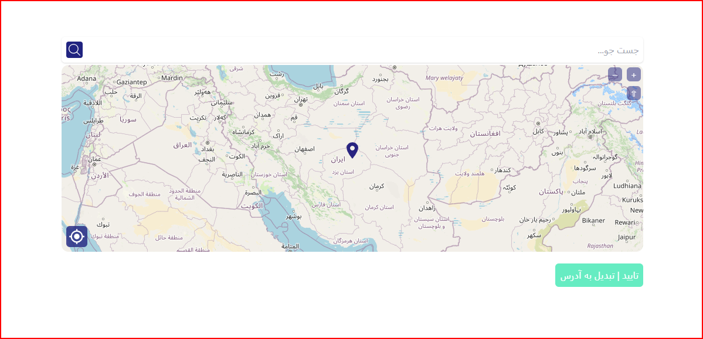

# Soblez map for woocommerce


## Description
This is a small program to create the ability to select a location and automatically convert it to the user's exact address, which can be used easily in any way and in any larger program.

## Used packages
* [React.js](https://react.dev/) @18.2.0
* [ol (OpenLayers)](https://openlayers.org/) @8.1.0
* [axios](https://axios-http.com/) @1.6.0
* [tailwindcss](https://tailwindcss.com/) @3.3.3

We also used [openstreetmap](https://nominatim.openstreetmap.org/) api to get the selected address using geolocation and also get user search results

## How to use this
#### You can clone this repository and run the following commands
In the first step, install all the packages (requires NodeJS):
```
$ npm install
```

For preview:
```
$ npm run dev
```

Build from project and production mode:
```
$ npm run build
```
